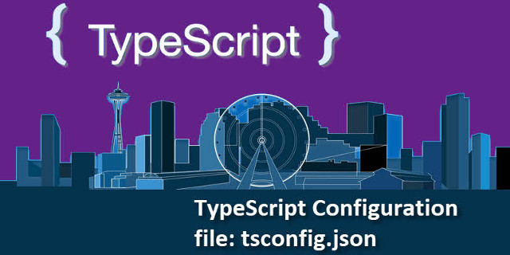

# tsconfig

[](https://www.npmjs.com/package/@chenyueban/tsconfig)
[](https://www.npmjs.com/package/@chenyueban/tsconfig?activeTab=versions)



> Picture: [What is tsconfig.json](https://www.kunal-chowdhury.com/2018/05/typescript-tutorial-tsconfig-json.html)

Clone from [tsconfig](https://github.com/Chatie/tsconfig).

Reusable TypeScript configuration files to extend from.

This module enables other module to inheritance tsconfig.json via Node.js packages

## USAGE

Extends from `@chenyueban/tsconfig` from your tsconfig.json, to have the chenyueban version of the TypeScript Configuration.

### CAUTION

Do not put any directory related configurations into this module.
Only put directory related configurations to the consumer of this module.

Because all directory in tsconfig.json is related to the curfrent directory.

## SEE ALSO

- [TypeScript 3.2 - tsconfig.json inheritance via Node.js packages](https://github.com/Microsoft/TypeScript/wiki/What's-new-in-TypeScript#tsconfigjson-inheritance-via-nodejs-packages)

> TypeScript 3.2 now resolves tsconfig.jsons from node_modules. When using a bare path for the "extends" field in tsconfig.json, TypeScript will dive into node_modules packages for us.
>
> ```json
> {
>     "extends": "@my-team/tsconfig-base",
>     "include": ["./**/*"]
>     "compilerOptions": {
>         // Override certain options on a project-by-project basis.
>         "strictBindCallApply": false,
>     }
> }
> ```
>
> Here, TypeScript will climb up node_modules folders looking for a @my-team/tsconfig-base package. For each of those packages, TypeScript will first check whether package.json contains a "tsconfig" field, and if it does, TypeScript will try to load a configuration file from that field. If neither exists, TypeScript will try to read from a tsconfig.json at the root. This is similar to the lookup process for .js files in packages that Node uses, and the .d.ts lookup process that TypeScript already uses.
>
> This feature can be extremely useful for bigger organizations, or projects with lots of distributed dependencies.

## DEPENDENCES

This module will run a unit test before it could be able to publish to NPM.

The unit test load tsconfig schema from [JSON Schema Store](http://schemastore.org/) and then use [is-my-json-valid](https://www.npmjs.com/package/is-my-json-valid) to validate it.
